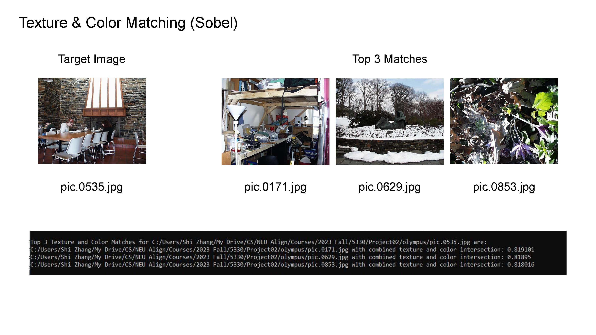
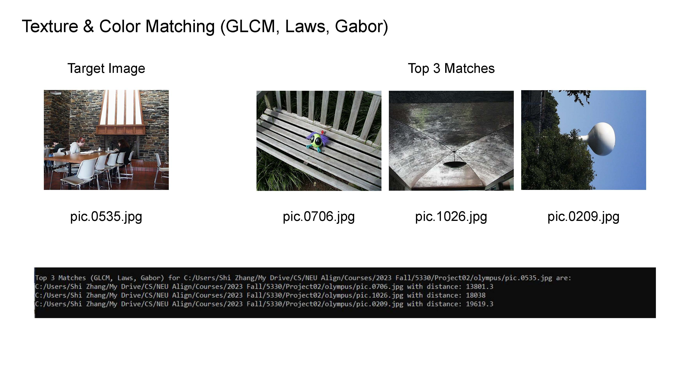
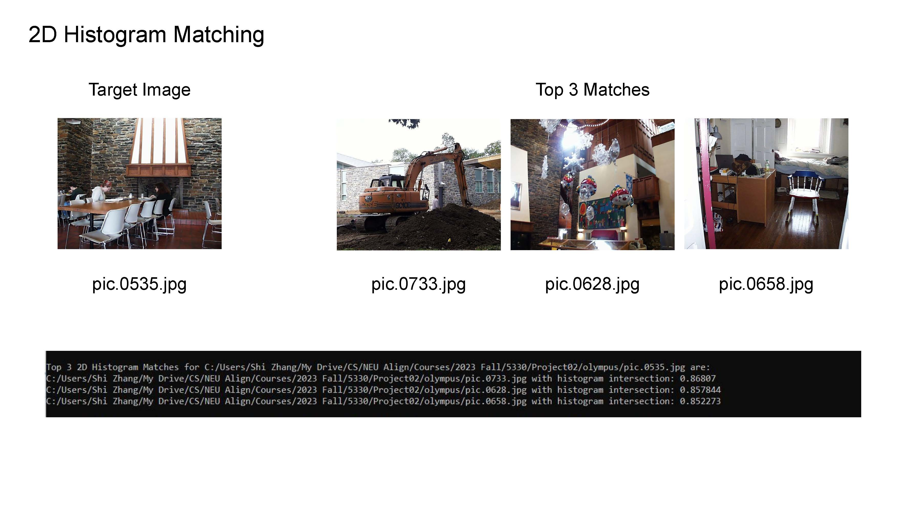
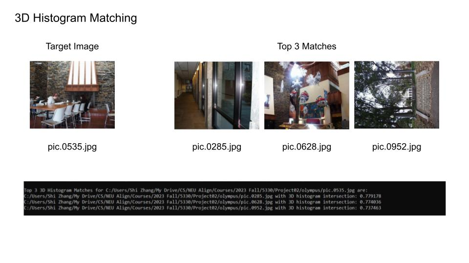
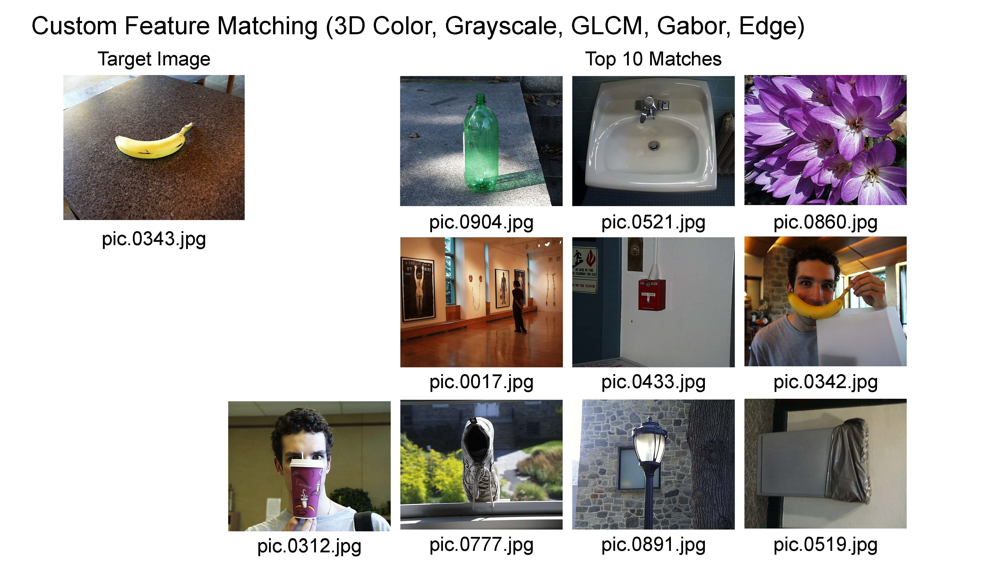
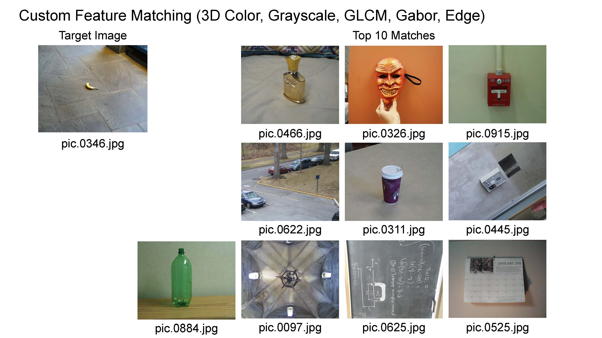

# CS5330 Content-based Image Retrieval

CS5330 Pattern Recognition & Computer Vision

NEU 2023 Fall

Instructor: Bruce Maxwell

Student: Shi Zhang

Last modified: 12/09/2023

## Project Report

### 1. Project Description

This project focuses on image feature extraction and matching. The primary objective is to extract relevant features from an image and store them in a CSV file. These features are then compared against other images to find the closest matches based on various algorithms like histogram matching, GLCM, and Gabor filters. The project demonstrates how different feature extraction and comparison techniques can yield different results, helping us understand the nuances and importance of each method in image processing.

### 2. Project Illustrations

#### Task 1: Baseline Matching

Given target image pic.1016.jpg, the top 3 matches with baseline matching are pic.0986.jpg, pic.0641.jpg, and pic.0233.jpg.

#### Task 2: Histogram Matching

Given target image pic.0164.jpg, the top 3 matches with 2D histogram matching are pic.0080.jpg, pic.1032.jpg, and pic.0461.jpg.

Given target image pic.0164.jpg, the top 3 matches with 3D histogram matching are pic.0110.jpg, pic.1032.jpg, and pic.0092.jpg.

#### Task 3: Multi-histogram Matching

Given target image pic.0274.jpg, the top 3 matches with multi-histogram matching are pic.0273.jpg, pic.1031.jpg, and pic.0409.jpg.

#### Task 4: Texture and Color

Given target image pic.0535.jpg, the top 3 matches with texture histogram matching using Sobel operator are pic.0171.jpg, pic.0629.jpg, and pic.0853.jpg.

Given target image pic.0535.jpg, the top 3 matches with GLCM, Laws, and Gabor matching are pic.0706.jpg, pic.1026.jpg, and pic.0209.jpg.

If we compare the results with Task 2 and Task 3:

Given target image pic.0535.jpg, the top 3 matches with 2D histogram matching are pic.0733.jpg, pic.0628.jpg, and pic.0658.jpg.

Given target image pic.0535.jpg, the top 3 matches with 3D histogram matching are pic.0285.jpg, pic.0628.jpg, and pic.0952.jpg.

Given target image pic.0535.jpg, the top 3 matches with multi-histogram histogram matching are pic.0285.jpg, pic.0628.jpg, and pic.0952.jpg.

#### Task 5: Custom Design

I tried to search for visually similar result of a banana, with a custom feature matching function that takes 3D color histogram, GLCM features, Gabor features, edge histogram into a single feature vector for comparison.

Here is the terminal output for the top 10 custom feature matches and least similar images given target image pic.0343.jpg and pic.0346.jpg.

Here is the result visualization of the top 10 matches for target image pic.0343.jpg.

Here is the result visualization of the top 10 matches for target image pic.0346.jpg.

### 3. Extensions and Example Images

The several extensions I proceed with are:

- Function to compute features from the co-occurrence matrix.
- Function to compute histograms of Laws filter responses.
- Function to compute histograms of Gabor filter responses.
- Function to compute the histogram of gradient orientations using Canny edge detector
- Custom Matching also provides the top 10 least similar matches.

### 4. Reflection

Throughout the course of this project, I delved deep into the nuances of image feature extraction and matching. I learned about the importance of selecting the right features for different tasks and how different algorithms can provide varying results. The project also reinforced the significance of preprocessing and normalization, especially when working with diverse image datasets.

### 5. Acknowledgments

I would like to acknowledge Professor Bruce Maxwell for the help in code review and troubleshooting during the office hour.

For many of the work present in this assignment, I referred to the sources below:

- [Computer Vision: Algorithms and Applications, 2nd ed. © 2022 Richard Szeliski, The University of Washington](http://szeliski.org/Book/)
- [Visual Recognition Course from University of Toronto, Winter 2012](https://www.cs.toronto.edu/~urtasun/courses/VisualRecognition/visual_recognition.html)
- [Computer Vision Course from University of Toronto, Winter 2013](https://www.cs.toronto.edu/~urtasun/courses/CV/cv.html)

## Project Running Instructions

### Development Environment

Operating System: Windows 10

IDE: Visual Studio 2022

OpenCV: 4.6.0

### Execution Instructions

#### OpenCV Setup for windows

I used OpenCV 4.6.0 Version for this project.

Before run the application, you will need to add the Path for environment variables on Windows.

This step can be referred to this tutorial: [Setup OpenCV in Visual Studio 2022 for C/C++ Development](https://www.youtube.com/watch?v=unSce_GPwto)

#### Project Setup within Visual Studio 2022

##### Step 1: Create a Solution

Open Visual Studio.
Go to File -> New -> Project....
In the Create a new project dialog, choose Empty Project under Installed -> Visual C++.
Name the Solution (e.g., ImageProcessingSolution) and the Project (e.g., ImgExtraction2CSV) and choose a location to save it. Click Create.

##### Step 2: Add the First Project

In Solution Explorer, right-click on the ImgExtraction2CSV project.
Choose Add -> New Item....
Select C++ File (.cpp), name it (e.g., imgExtraction2csv.cpp), and click Add.
Copy and paste the code for imgExtraction2csv.cpp into this file.
Add any additional header files, source files, or resources that this project needs in a similar manner.

##### Step 3: Add the Second Project

In Solution Explorer, right-click on the Solution (not the project).
Choose Add -> New Project....
Again choose Empty Project under Installed -> Visual C++.
Name the second project (e.g., FeatureMatching) and click Create.
In Solution Explorer, right-click on the FeatureMatching project.
Choose Add -> New Item....
Select C++ File (.cpp), name it (e.g., featureMatching.cpp), and click Add.
Copy and paste the code for featureMatching.cpp into this file.
Add any additional header files, source files, or resources that this project needs in a similar manner.

##### Step 4: Set Project Dependencies (if any)

If one project depends on the other, right-click on the Solution in Solution Explorer.
Go to Project Dependencies....
Select a project from the Projects dropdown menu.
Check the projects it depends on.

##### Step 5: Update the file path for your local environment.

###### Go to imgExtraction2CSV.cpp.

- std::string directory_path is for the image library, where you saved the given image database folder in your local drive.

- char filename[] is for the CSV file saved in your local drive.

###### Go to featureMatching.cpp.

- char filename[] is for accessing the CSV file saved in your local drive.

- std::string baseline_target_image_path is for the target image from your image database for baseline matching.

- std::string histogram_target_image_path is for the target image from your image database for histogram matching.

- std::string multiHistogram_target_image_path is for the target image from your image database for multi-histogram matching.

- std::string textureColor_target_image_path is for the target image from your image database for texture and color matching.

- std::vector<std::string> queryImages is for the two target images from your image database for custom matching.

##### Step 6: Build and Run the Projects

To build a specific project, right-click on the project in Solution Explorer and choose Build.
To run a specific project, right-click on the project in Solution Explorer and choose Set as StartUp Project, then press F5 or click on the Start Debugging button.

##### Step 7: Debugging and Running

You can debug or run each project separately by setting it as the startup project.

### Time Travel Days

I did not use any time travel days in this assignment.
